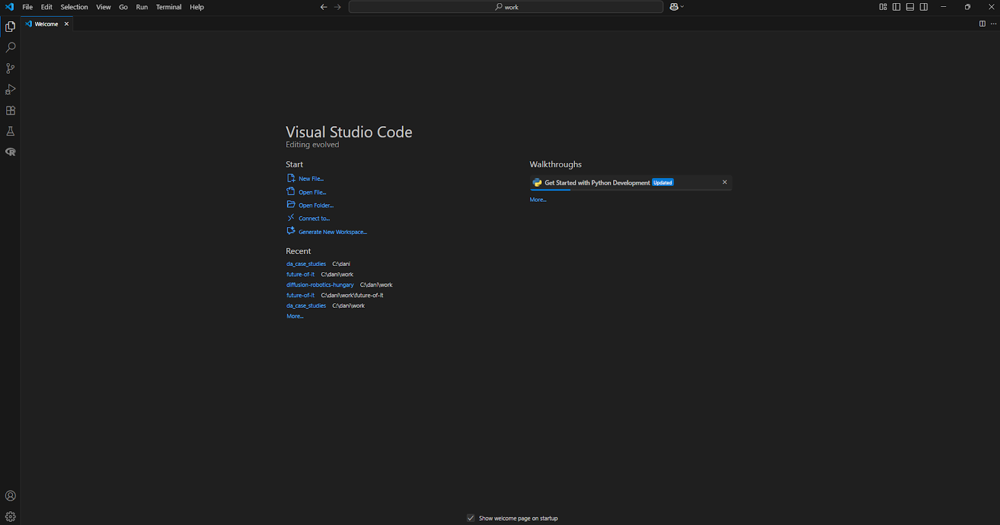
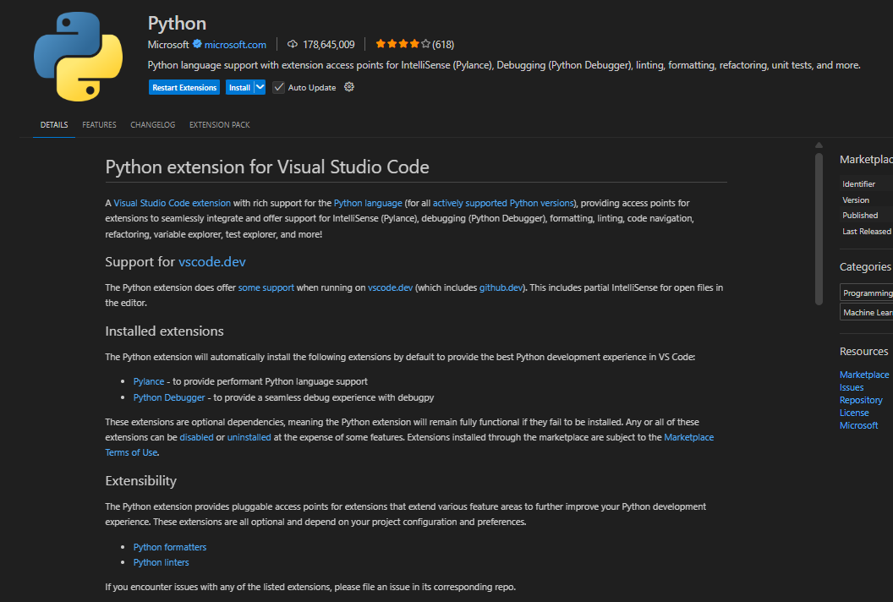
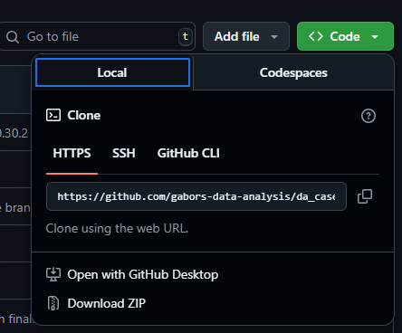
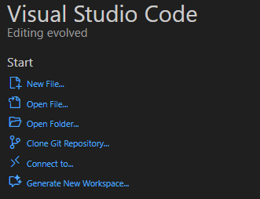
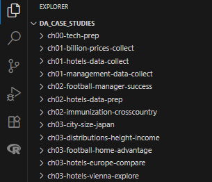
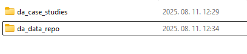

# How to set up the Python environment

This guide prepares your computer to run the Python notebooks for the Data
Analysis case studies. The project uses [uv](https://docs.astral.sh/uv/) to
install Python, create an isolated environment, and install the exact package
versions recorded in `uv.lock`.

The instructions work on Windows, macOS, and Ubuntu/Debian Linux. For a setup
that runs entirely in your browser, use the pre-configured
[GitHub Codespace](da-setup-codespaces.md).

## What you need

- **uv** manages Python and the project environment.
- **Visual Studio Code** provides the editor and notebook interface.
- **Git** downloads and updates the repository.
- **Graphviz** is used by decision-tree diagrams.
- **OpenMP** is required by XGBoost on macOS.

The project uses Python 3.12.4. You do not need to install Python separately:
uv installs the correct version when it creates the environment.

## 1. Install uv

Install the same uv version used by the project and GitHub Actions.

### Windows PowerShell

Open PowerShell and run:

```powershell
powershell -ExecutionPolicy ByPass -c "irm https://astral.sh/uv/0.11.20/install.ps1 | iex"
```

### macOS and Linux

Open a terminal and run:

```bash
curl -LsSf https://astral.sh/uv/0.11.20/install.sh | sh
```

Close and reopen the terminal, then verify the installation:

```bash
uv --version
```

See the [official uv installation guide](https://docs.astral.sh/uv/getting-started/installation/)
for alternative installation methods.

## 2. Install VS Code

Download and install [Visual Studio Code](https://code.visualstudio.com/Download).



Open the Extensions panel and install:

- [Python](https://marketplace.visualstudio.com/items?itemName=ms-python.python)
- [Jupyter](https://marketplace.visualstudio.com/items?itemName=ms-toolsai.jupyter)



## 3. Install Git and clone the repository

Install [Git](https://git-scm.com/downloads), then open a terminal and run:

```bash
git clone https://github.com/gabors-data-analysis/da_case_studies.git
cd da_case_studies
```

Alternatively, copy the repository URL from GitHub:



Then choose **Clone Git Repository...** on the VS Code start screen:



Open the cloned `da_case_studies` folder in VS Code. The Explorer should show
the chapter directories:



## 4. Install system dependencies

uv installs Python packages, but it does not install operating-system
programs and libraries.

### Windows

Download and run the current 64-bit installer from the
[Graphviz download page](https://graphviz.org/download/). Keep the option that
adds Graphviz to `PATH` enabled if the installer offers it, then reopen your
terminal.

### macOS

Install [Homebrew](https://brew.sh/) if it is not already available, then run:

```bash
brew install graphviz libomp
```

`libomp` supplies the OpenMP runtime required by the macOS XGBoost wheel.

### Ubuntu or Debian Linux

```bash
sudo apt-get update
sudo apt-get install graphviz
```

## 5. Create and verify the environment

In a terminal, change to the repository root: the directory containing
`pyproject.toml` and `uv.lock`. Then run:

```bash
uv sync --frozen
```

uv will:

1. Install Python 3.12.4 if needed.
2. Create an isolated `.venv` directory.
3. Install the exact dependencies from `uv.lock`.

Verify the Python environment:

```bash
uv run --frozen python -c "import numpy, pandas, xgboost; print('Python environment is ready')"
```

Verify Graphviz:

```bash
dot -V
```

You do not need to activate `.venv`. Run terminal commands through `uv run`,
for example:

```bash
uv run --frozen python --version
```

## 6. Select the environment in VS Code

Open a notebook in VS Code:

1. Click **Select Kernel** in the top-right corner.
2. Choose **Python Environments**.
3. Select `da-case-studies (3.12.4)`. If that label is not shown, select the
   interpreter inside the repository's `.venv` directory.

The interpreter path ends in `.venv/bin/python` on macOS and Linux, or
`.venv\Scripts\python.exe` on Windows. VS Code normally discovers it
automatically after `uv sync`.

## 7. Get the data

Data is hosted on OSF. You can either:

1. Download the complete data repository from
   [OSF](https://osf.io/3u5em/files/osfstorage).
2. Download individual datasets from [OSF](https://osf.io/7epdj/).

Unzip or create `da_data_repo` next to `da_case_studies`:



```text
parent-folder/
├── da_case_studies/
└── da_data_repo/
```

You can now run notebook cells in VS Code.

## Updating the project

Pull the latest code and restore the locked environment:

```bash
git pull
uv sync --frozen
```

Project maintainers should use `uv add`, `uv remove`, or `uv lock` when
dependencies intentionally change, and commit both `pyproject.toml` and
`uv.lock`.

## Troubleshooting

- If `uv` is not found, close and reopen the terminal after installation.
- If VS Code does not show `.venv`, run `uv sync --frozen`, then use
  **Developer: Reload Window** from the Command Palette.
- If `dot` is not found, reinstall Graphviz and ensure its `bin` directory is
  on `PATH`.
- If XGBoost reports a missing `libomp.dylib` on macOS, run
  `brew install libomp` and reopen VS Code.
- If XGBoost reports a missing DLL on Windows, install Microsoft's
  [Visual C++ Redistributable](https://learn.microsoft.com/en-us/cpp/windows/latest-supported-vc-redist).
