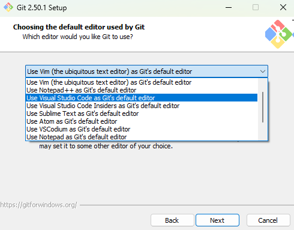

# How to set up the Python environment to do Data Analysis

So you decided to use Python for Data Analysis. Great choice. Python is the leading coding language for Data Science, and is emerging as a widely used language in analysis, in statistics and econometrics. 

As you'll see its not as easy as in Stata or even in R. It's not plug and play. You're gonna need to do some plumbing. So make sure you have about two hours to do this.  The whole procedure might seem too long and tedious, but afterwards you will have a collection of softwares that you will find useful later on. Indeed, using an editor like VScode, git and Github and will be essential skills. We'll be gentle: this user guide is written by people with a background in economics not computer science. 

Once you set up these essential tools, they will not only help you reproduce the graphs and tables in the book, but also set you up for success in future data analysis and programming projects.

Okay, if you just wanna have a quick look, or  do not want to go through the detailed installation process, go to the [quick version](https://github.com/gabors-data-analysis/da_case_studies/edit/master/ch00-tech-prep/da-setup-python.md#plan-b-a-minimum-requirements-option) (python + jupyter notebook) that shows a faster but less reliable way to acces the case studies in Python. 


## Overview

We use the following technologies for the Python version:

-  **Anaconda (Python distribution & environment manager)**  
We use `conda` to set up the environment because it’s a reliable and beginner-friendly way to manage Python and all the extra packages that data analysis usually needs. Anaconda is more than just Python - it comes with a ready-made collection of data science tools, plus conda itself, which lets you create separate environments for different projects. That way you don’t have to worry about one project breaking another, or about messy version conflicts. A version conflict happens when two libraries depend on different versions of the same underlying package. For example, one tool might only work with an older version of NumPy while another requires the newest release, and trying to install both in the same place can cause errors or unexpected behavior. Using isolated conda environments avoids this problem completely. It also ensures the code in this book will run the same way on your computer as it did on ours, so you’ll get the same results when you re-run the examples.
There are other good tools for managing environments, like [pip](https://pipenv.pypa.io/en/latest/), [uv](https://docs.astral.sh/uv/), or [pixi](https://pixi.sh/latest/). Each has its own strengths, and people have their personal favorites. We went with conda because it’s something of a standard in data science and you’re likely to run into it again in the future.

- **Visual Studio Code (code editor)**  
  VS Code is a lightweight, highly customizable editor with great Python support. It provides features like syntax highlighting, debugging tools, integrated terminals, and extensions that make writing and running code smoother. Once you know your way around VS Code, you can use it for almost any programming language or project. You can edit Python scripts or notebooks with other softwares as well but we think that this is the easiest and most 

- **Git (version control)**  
  Git tracks changes to your code, letting you experiment, roll back mistakes, and collaborate without losing work. Even if you’re working alone, Git acts as a safety net and a history of your progress—skills that translate directly to professional software development.

- **GitHub (remote collaboration platform)**  
  GitHub hosts your Git repositories online, enabling you to back up your work and share it with others. It’s also a hub for discovering open-source projects, contributing to them, and showcasing your own work—a valuable asset for any future works.

- **How these tools fit together**  
In this textbook, you will open and run example Python code in VS Code, using environments managed by Anaconda to ensure all the required packages are available. Git and GitHub make it easy to download the latest version of the code, keep your local copy organized, and explore updates. This setup mirrors a common professional workflow, so you’ll not only follow along with the material here but also gain familiarity with tools widely used in data science and software development.

## 1. Install Anaconda 

Go to the Anaconda [website](https://www.anaconda.com/download) and provide your email to download the distribution. You will get the download link via email.

Click the installer and follow the [installation process](https://www.anaconda.com/docs/getting-started/anaconda/install), making sure to select the version that matches your operating system.

During installation, always use the recommended options


Once you have installed Anaconda open `Anaconda Navigator`. Here you will see a number of applications, some of them already installed, some to be installed optionally, for your data science workflow. To set up the environment for the textbook, you will only need `Anaconda Prompt` but other applications can be useful later for other projects. Open `Anaconda Prompt` that we will get back to in Step 5.


## 2. Using the Terminal
The **terminal** (or [*command-line interface*](https://en.wikipedia.org/wiki/Command-line_interface) (`CLI`)) is a powerful way to interact with your computer using text commands instead of graphical menus. While graphical user interfaces (GUIs) are intuitive, running a single command is often much faster than opening a GUI, navigating through menus, and clicking the right options to complete a task.
In data analysis, the terminal is essential because it lets you work consistently across Windows, macOS, and Linux, automate workflows, and access advanced features that may not be available in GUI tools. With just a few commands, you can run programs, manage packages, and create reproducible environments.
At first, the terminal, a black window with a blinking cursor as shown in the screenshot below, might seem intimidating, but with a little practice it will become one of your most valuable tools.


All major operating systems include a built-in terminal that runs a **shell**, the program that interprets your commands. On Windows, search for “Command Prompt” or “PowerShell” in the Start menu. You can also press `Windows + R`, type `cmd`, and hit Enter to open Command Prompt directly. On macOS, open Terminal from `Applications → Utilities` or search for it using Spotlight (`Cmd + Space`, type “Terminal”). On Linux, press `Ctrl + Alt + T` or search for Terminal in your application menu.  

In this course, you will also use the terminal to work with **Anaconda**. While Anaconda comes with a graphical tool called *Anaconda Navigator*, using it in the terminal is faster and more flexible for installing packages, creating project environments, and reproducing your setup on different systems.

On Windows, Anaconda includes a dedicated terminal called **Anaconda Prompt**, which is preconfigured for `conda` commands. You can open it directly from the Start menu or [add it to Windows Terminal](https://dev.to/azure/easily-add-anaconda-prompt-in-windows-terminal-to-make-life-better-3p6j) for convenience.  

On macOS and Linux, there is no separate Anaconda Prompt as there is on Windows. Instead, you use the system’s default terminal to access Anaconda. After installing Anaconda, activate the base environment by running:  

```bash
source <PATH_TO_CONDA>/anaconda3/bin/activate
conda init --all
```
Replace <PATH_TO_CONDA> with the actual installation path of Anaconda on your system (for example /Downloads or /home/yourusername). This enables you to use conda commands just like in Anaconda Prompt on Windows.

For a clarification of the exact differences between a terminal, a console, a shell, and a command-line interface, see [this article](https://www.freecodecamp.org/news/command-line-for-beginners/). 

## 3. Get VS Code

You can download VS Code from https://code.visualstudio.com/Download . Use the recommended options during installation (do not tick or untick anything) and open it after it has finished installing. It should look something like this:


On the left panel go to `Extensions` and search for Python: 


Click `Install`. Now do the same for `Jupyter`. 

## 4. Install Git and register to GitHub

Git runs locally on your PC but you can synchronize your local development with a web-based service where you can publicly share your code with others. We are using [GitHub](https://github.com/) for this purpose.  

**Installing git**: Go to https://git-scm.com/downloads and install the version you need (Windows/Mac/Linux).

**Important!**: during the installation process select the `Use Visual Studio Code as Git's default editor` option when prompted for the default editor. Leave all other options as recommended by the installer. 




Once you have installed git go to https://github.com/ and register and account. After registration open the terminal and enter the following two commands using your username and and email address:

```bash
git config --global user.name "yourusername"
git config --global user.email youremail@example.com
```

This will make sure that you can interact with your GitHub account from your terminal or from an IDE such as VS Code. 

Once you have VS Code and Git installed, visit the [GitHub repository for the case studies](https://github.com/gabors-data-analysis/da_case_studies). Click on the **Code** button and copy the HTTPS link. 


Then go back to VS Code and in the top-left corner, click on File>Open Folder.


Select the folder where you want to store the codes for the case studies. In the middle of your screen, choose the option **Clone Git Repository…**


Paste the HTTPS link you just copied and choose the folder where you want to store the codes. The left panel now should look like this:


Now you have the latest version of the codes on your computer. To run them properly, you also need to set up the same environment that we used during development for which we will use **Conda**.

## 5. Create a virtual environment 

We are using `conda` to manage our environments and `pip` to download Python packages and to manage the dependencies between them. 

Type `Anadonda prompt` in the program search bar and open the application. This is a command line inteface, or CLI, with which you can interact with your Anaconda environment. This is the main environment where your Python code will run. Next, navigate to the folder, where you just installed the codes. The easiest way of doing this is by first opening the File Explorer and copying the folder's path. Then, type

```bash
cd path/to/folder/da_case_studies/ch00-tech-prep
```
into `Anaconda prompt` with your path. The command `cd` refers to ‘change directory’. Once inside the da_case_studies folder, type

```bash
dir
```
which lists all the files and directories inside the current directory (where you have all the folders for each case study). At the end of the list, you should see `daenv_macos`, `daenv_windows` and `daenv_linux`. 

Next, type:

```bash
conda env create -f daenv_{SYSTEM}
```

Replace {SYSTEM} with windows, macos or linux, depending on which one you use. Type “a” when this message comes up:

 Wait a few minutes, until it finishes. To activate the environment, type: 

```bash
conda activate daenv
```

Once you are finished with a session, you can deactivate the environment by typing:

```bash
conda deactivate
```

*When closing your Anaconda Prompt window, your virtual environment will get deactivated automatically.*

## 6. Getting the Data

Now everything is set up, only the data is missing. There are two options you can choose from: 

### Option 1:
You can either download all the datasets for all case studies from [OSF](https://osf.io/3u5em/files/osfstorage). If you choose this option, make sure to unzip the **da_data_repo** next to the **da_case_studies** folder.

It should look like this:


### Option 2:
Download data for specific case studies from [OSF](https://osf.io/7epdj/). If you choose this option, create a folder called **da_data_repo** next to the **da_case_studies** folder and download the data for the case studies there.

Once you have the data installed, in VS Code open any of the **jupyter notebooks** (that contain the python codes), on the top of your screen select **daenv** as the environment to run the codes in, and run it.


# Plan B: A minimum Requirements Option
If you do not want to set up the environment, download VS Code and the data, there is a more simple version you can choose as well. 

## 1. Install Python

If you don't already have Python installed, download and install it from the official website:  
 [https://www.python.org/downloads](https://www.python.org/downloads)

**Important:** During installation, make sure to check the box **“Add Python to PATH”**

## 2. Install jupyter

Type 

```bash
pip install notebook
```
and then 

```bash
jupyter notebook
```

into your Terminal. This opens a browser that can run jupyter notebooks. You can find more info on how jupyter works, see their official [website](https://jupyter.org/). 


## Credits
This note is based on the setup by [Péter Duronelly](https://github.com/peterduronelly/python-for-data-analysis/tree/main/class-00-setting-up-your-data-science-environment), edited by Daniel Barabás and Gábor Békés and Tanya Yakushina. All this is strongly related to teaching [Data Analysis](https://gabors-data-analysis.com/) at [CEU](https://economics.ceu.edu/program/master-science-business-analytics)


